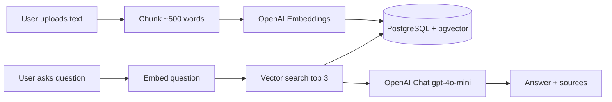

# RAG Document Q&A

🇺🇸 **English** | 🇧🇷 [Português](README.pt-BR.md)

Upload a document, ask questions in natural language, and get answers grounded in the ingested content. This project is a full-stack **Retrieval-Augmented Generation (RAG)** demo: a **React (Vite)** frontend talks to a **.NET** API backed by **PostgreSQL + pgvector**, with **OpenAI** handling embeddings and chat completion.

---

## Features

- **Document ingestion**: Paste text with a title and optional source URL; the API chunks, embeds, and stores it automatically.
- **Grounded Q&A chat**: Ask questions and receive answers based only on retrieved document chunks.
- **Semantic retrieval**: Questions are embedded and matched against stored chunks using cosine similarity (`top 3` by default).
- **Source attribution**: Responses include the document titles used as context.
- **Source management**: List all ingested sources and delete a document (all its chunks) by title.
- **Modern UI**: React + TypeScript chat interface with dark mode and Portuguese UI copy.

---

## Tech Stack

### Frontend
- **React 19** + **Vite**
- **TypeScript**
- **Custom CSS** with light/dark theme support
- **react-markdown** for rendered assistant messages

### Backend
- **.NET 9** (C# / ASP.NET Core Web API)
- **Entity Framework Core** + **Npgsql**
- **PostgreSQL** with **pgvector** for vector storage and similarity search
- **OpenAI API**
  - `text-embedding-3-small` for embeddings (1536 dimensions)
  - `gpt-4o-mini` for chat completion

---

## Architecture Overview

RAG in this project follows a classic ingest-then-query pipeline:

```text
Upload → Chunk → Embed → Store → Query → Retrieve → Answer
```

| Step | What happens |
| :--- | :--- |
| **Upload** | The user pastes document text via `POST /api/ingest` (title, content, optional source). |
| **Chunk** | The backend splits content into ~500-word word-based chunks. |
| **Embed** | Each chunk is sent to OpenAI Embeddings and converted to a vector. |
| **Store** | Chunks and vectors are persisted in PostgreSQL (`documents` table, `vector(1536)` column). |
| **Query** | The user asks a question via `POST /api/chat`. |
| **Retrieve** | The question is embedded; pgvector returns the nearest chunks by cosine distance. |
| **Answer** | Retrieved chunks are passed as context to `gpt-4o-mini`, which generates a grounded reply with source names. |



---

## Quick Start

### Prerequisites

- [.NET 9 SDK](https://dotnet.microsoft.com/download)
- [Node.js](https://nodejs.org/) (v18+)
- **PostgreSQL** with the **pgvector** extension enabled
- An **OpenAI API key**

### 1. Database Setup

1. Create a PostgreSQL database (e.g. `rag`).
2. Enable pgvector in that database:

```sql
CREATE EXTENSION IF NOT EXISTS vector;
```

3. Update the connection string in `rag-api/appsettings.Development.json` (see step 2).

### 2. Backend (`rag-api`)

Copy the template and add your local secrets:

```bash
cd rag-api
cp appsettings.json appsettings.Development.json
```

Edit `appsettings.Development.json`:

```json
{
  "ConnectionStrings": {
    "DefaultConnection": "Host=localhost;Port=5432;Database=rag;Username=postgres;Password=YOUR_PASSWORD"
  },
  "OpenAI": {
    "ApiKey": "YOUR_OPENAI_API_KEY"
  }
}
```

Alternatively, set environment variables (ASP.NET Core configuration):

| Variable | Maps to |
| :--- | :--- |
| `OpenAI__ApiKey` | `OpenAI:ApiKey` |
| `ConnectionStrings__DefaultConnection` | `DefaultConnection` |

Apply migrations and run the API:

```bash
dotnet ef database update
dotnet run
```

The API listens at **`http://localhost:5282`**.

### 3. Frontend (`rag-web`)

```bash
cd rag-web
npm install
npm run dev
```

The UI is available at **`http://localhost:5173`**.

> **Note:** The frontend calls `http://localhost:5282` by default (`rag-web/src/services/api.ts`). Change `API_BASE` if your API runs elsewhere.

### 4. Try it

1. Open the UI and paste a document under **Ingerir documento**.
2. Click **Ingerir** and wait for the success message.
3. Ask a question in the chat panel — answers should cite your ingested sources.

---

## API Reference

Base URL: `http://localhost:5282`

| Method | Endpoint | Description |
| :--- | :--- | :--- |
| `POST` | `/api/ingest` | Ingest a document (`title`, `content`, optional `source`) |
| `POST` | `/api/chat` | Ask a question (`question`); returns `answer` and `sources` |
| `GET` | `/api/sources` | List distinct ingested sources |
| `DELETE` | `/api/sources/{title}` | Remove all chunks for a given title |

**Ingest example**

```json
POST /api/ingest
{
  "title": "Product FAQ",
  "source": "https://example.com/faq",
  "content": "Your full document text here..."
}
```

**Chat example**

```json
POST /api/chat
{
  "question": "What is the return policy?"
}
```

---

## Project Structure

```text
├── rag-api/                 # ASP.NET Core Web API
│   ├── Controllers/         # ingest, chat, sources endpoints
│   ├── Services/            # OpenAI embeddings, chat, vector search
│   ├── Models/              # Document, request/response DTOs
│   ├── Data/                # EF Core DbContext
│   ├── Migrations/          # PostgreSQL schema (pgvector)
│   └── appsettings.json     # Committed template (no secrets)
├── rag-web/                 # Vite + React frontend
│   └── src/
│       ├── components/      # ChatWindow, IngestForm, ThemeSwitch, …
│       └── services/        # Fetch client for the API
├── README.md
└── README.pt-BR.md
```

---

## Configuration & Secrets

- **`rag-api/appsettings.json`** — placeholder template, safe to commit.
- **`rag-api/appsettings.Development.json`** — local overrides with real credentials; **gitignored**.
- Never commit OpenAI keys or database passwords. Rotate any key that was ever exposed.
