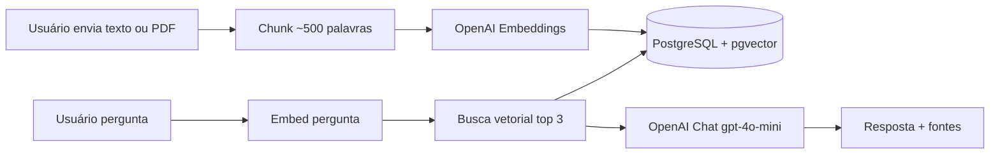

# RAG Document Q&A

🇺🇸 [English](README.md) | 🇧🇷 **Português**

Faça upload de um documento, faça perguntas em linguagem natural e receba respostas baseadas no conteúdo ingerido. Este projeto é uma demonstração full-stack de **Retrieval-Augmented Generation (RAG)**: um frontend **React (Vite)** consome uma API **.NET** com **PostgreSQL + pgvector**, usando a **OpenAI** para embeddings e chat completion.

---

## Funcionalidades

- **Ingestão de documentos**: Cole texto ou envie um PDF; a API extrai o texto, divide em chunks, gera embeddings e persiste automaticamente.
- **Upload de PDF**: PDFs com texto de até **5MB** e **20 páginas** (PDFs escaneados/imagem não são suportados).
- **Chat Q&A fundamentado**: Faça perguntas e receba respostas usando apenas os trechos recuperados dos documentos.
- **Recuperação semântica**: Perguntas são convertidas em vetores e comparadas aos chunks armazenados por similaridade de cosseno (`top 3` por padrão).
- **Atribuição de fontes**: As respostas incluem os títulos dos documentos usados como contexto.
- **Gestão de fontes**: Liste todas as fontes ingeridas e remova um documento (todos os seus chunks) pelo título.
- **Interface moderna**: Chat em React + TypeScript com modo escuro e textos da UI em inglês.

---

## Stack Tecnológica

### Frontend
- **React 19** + **Vite**
- **TypeScript**
- **CSS customizado** com suporte a tema claro/escuro
- **react-markdown** para mensagens do assistente

### Backend
- **.NET 9** (C# / ASP.NET Core Web API)
- **Entity Framework Core** + **Npgsql**
- **PostgreSQL** com **pgvector** para armazenamento vetorial e busca por similaridade
- **OpenAI API**
  - `text-embedding-3-small` para embeddings (1536 dimensões)
  - `gpt-4o-mini` para chat completion
- **PdfPig** para extração de texto de PDF (pure .NET, compatível com Docker)

---

## Visão Geral da Arquitetura

O RAG neste projeto segue um pipeline clássico de ingestão e consulta:

```text
Upload → Chunk → Embed → Store → Query → Retrieve → Answer
```

| Etapa | O que acontece |
| :--- | :--- |
| **Upload** | O usuário cola texto ou envia um PDF via `POST /api/ingest` (JSON ou `multipart/form-data`). |
| **Chunk** | O backend divide o conteúdo em chunks de ~500 palavras. |
| **Embed** | Cada chunk é enviado à OpenAI Embeddings e vira um vetor. |
| **Store** | Chunks e vetores são salvos no PostgreSQL (tabela `documents`, coluna `vector(1536)`). |
| **Query** | O usuário faz uma pergunta via `POST /api/chat`. |
| **Retrieve** | A pergunta é embedada; o pgvector retorna os chunks mais próximos por distância de cosseno. |
| **Answer** | Os chunks recuperados viram contexto para o `gpt-4o-mini`, que gera a resposta com os nomes das fontes. |



---

## Início Rápido

### Pré-requisitos

- [.NET 9 SDK](https://dotnet.microsoft.com/download)
- [Node.js](https://nodejs.org/) (v18+)
- **PostgreSQL** com a extensão **pgvector** habilitada
- Uma **chave de API da OpenAI**

### 1. Configuração do Banco

1. Crie um banco PostgreSQL (ex.: `rag`).
2. Habilite o pgvector nesse banco:

```sql
CREATE EXTENSION IF NOT EXISTS vector;
```

3. Atualize a connection string em `rag-api/appsettings.Development.json` (veja o passo 2).

### 2. Backend (`rag-api`)

Copie o template e adicione seus segredos locais:

```bash
cd rag-api
cp appsettings.json appsettings.Development.json
```

Edite `appsettings.Development.json`:

```json
{
  "ConnectionStrings": {
    "DefaultConnection": "Host=localhost;Port=5432;Database=rag;Username=postgres;Password=SUA_SENHA"
  },
  "OpenAI": {
    "ApiKey": "SUA_OPENAI_API_KEY"
  }
}
```

Alternativamente, use variáveis de ambiente (configuração do ASP.NET Core):

| Variável | Mapeia para |
| :--- | :--- |
| `OpenAI__ApiKey` | `OpenAI:ApiKey` |
| `ConnectionStrings__DefaultConnection` | `DefaultConnection` |

Aplique as migrations e inicie a API:

```bash
dotnet ef database update
dotnet run
```

A API fica disponível em **`http://localhost:5282`**.

### 3. Frontend (`rag-web`)

```bash
cd rag-web
npm install
npm run dev
```

A interface fica disponível em **`http://localhost:5173`**.

> **Nota:** O frontend chama `http://localhost:5282` por padrão (`rag-web/src/services/api.ts`). Altere `API_BASE` se a API rodar em outra URL.

### 4. Teste

1. Abra a UI e cole texto ou envie um PDF em **Ingest document**.
2. Clique em **Ingest** e aguarde a mensagem de sucesso.
3. Faça uma pergunta no chat — a resposta deve citar suas fontes ingeridas.

### Limites de upload de PDF

| Restrição | Limite |
| :--- | :--- |
| Tamanho máximo | 5 MB |
| Páginas máximas | 20 |
| PDFs suportados | Apenas com texto (não escaneados/imagem) |
| Texto mínimo extraído | 100 caracteres |

PDFs escaneados ou baseados em imagem retornam um erro claro. Uploads de PDF compartilham o mesmo limite de **5 uploads/hora por IP** da ingestão de texto.

---

## Referência da API

URL base: `http://localhost:5282`

| Método | Endpoint | Descrição |
| :--- | :--- | :--- |
| `POST` | `/api/ingest` | Ingestão via JSON (`title`, `content`, `source` opcional) ou PDF (`multipart/form-data`: `file`, `title` opcional, `source` opcional) |
| `POST` | `/api/chat` | Faz uma pergunta (`question`); retorna `answer` e `sources` |
| `GET` | `/api/sources` | Lista fontes ingeridas distintas |
| `DELETE` | `/api/sources/{title}` | Remove todos os chunks de um título |

**Exemplo de ingestão PDF**

```http
POST /api/ingest
Content-Type: multipart/form-data

file: (PDF, máx. 5MB / 20 páginas)
title: (opcional — padrão: nome do arquivo)
source: (opcional)
```

**Exemplo de ingestão de texto**

```json
POST /api/ingest
{
  "title": "FAQ do Produto",
  "source": "https://example.com/faq",
  "content": "Texto completo do documento aqui..."
}
```

**Exemplo de chat**

```json
POST /api/chat
{
  "question": "Qual é a política de devolução?"
}
```

---

## Estrutura do Projeto

```text
├── rag-api/                 # ASP.NET Core Web API
│   ├── Controllers/         # endpoints ingest, chat, sources
│   ├── Services/            # embeddings OpenAI, chat, busca vetorial, extração PDF
│   ├── Models/              # Document, DTOs de request/response
│   ├── Data/                # DbContext EF Core
│   ├── Migrations/          # schema PostgreSQL (pgvector)
│   └── appsettings.json     # template versionado (sem segredos)
├── rag-web/                 # frontend Vite + React
│   └── src/
│       ├── components/      # ChatWindow, IngestForm, ThemeSwitch, …
│       └── services/        # cliente fetch da API
├── README.md
└── README.pt-BR.md
```

---

## Configuração e Segredos

- **`rag-api/appsettings.json`** — template com placeholders, seguro para commit.
- **`rag-api/appsettings.Development.json`** — overrides locais com credenciais reais; **ignorado pelo git**.
- Nunca faça commit de chaves OpenAI ou senhas de banco. Revogue qualquer chave que tenha sido exposta.
